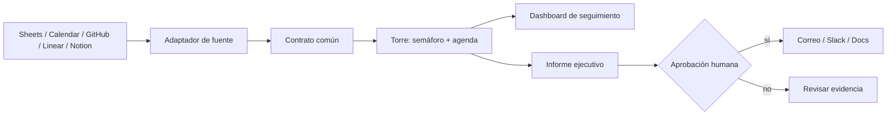

# Torre de Control Local — laboratorio n8n

Un ejercicio completo de automatización para clase: reúne proyectos, eventos y
calendario en un contrato común, calcula un semáforo, genera un informe
ejecutivo y conserva a una persona como responsable de las decisiones.

> No es una demo de “IA que hace todo”. Es una práctica de diseño: **fuentes →
> evidencia → reglas → informe → aprobación humana**.

## Qué entrega este repositorio

| Artefacto | Para qué sirve |
|---|---|
| `docker-compose.yml` | Arrancar n8n local y persistir sus datos. |
| `workflows/01-semilla-demostracion.json` | Práctica funcional sin cuentas ni API keys. |
| `workflows/02-torre-de-control.json` | Ingreso por contrato para conectar Calendar, Sheets, GitHub, Linear o Notion. |
| `workflows/03-informe-ejecutivo.json` | Informe en formato fijo, primero determinista y luego ampliable con IA. |
| `workflows/04-informe-con-modelo.json` | Extiende el informe con un modelo de lenguaje y valida su salida con un chequeo que detecta datos inventados (marca `RECHAZADO` si el modelo alucina). |
| `workflows/05-fuente-real-sin-codigo.json` | **Lee una hoja de cálculo real y calcula un semáforo auditable por alguien que no programa** — cero nodos de código, la regla queda a la vista y no en una caja negra. Funciona sin credenciales; se cambia una dirección para apuntar a tu propia hoja de Google. |
| `workflows/06-agenda-y-proyectos.json` | **Cruza proyectos con calendario.** Trae dos fuentes por separado (proyectos y eventos) y las une con el nodo Merge por el campo `proyecto`, para que cada evento salga con el estado y el responsable del proyecto detrás. Funciona sin credenciales; documenta cómo reemplazar la agenda de ejemplo por el Google Calendar propio con OAuth. |
| `workflows/07-informe-al-celular.json` | **El informe llega solo, sin que nadie lo toque.** Un `Schedule Trigger` corre cada lunes a las 7:00, reutiliza la cadena de lectura y semáforo del flujo `05`, arma un mensaje corto pensado para leerse en un teléfono y lo envía por Telegram. Documenta paso a paso cómo crear el bot con `@BotFather` y cómo obtener el chat ID propio. Es el momento en que el flujo deja de ser una herramienta que se aprieta y pasa a ser un proceso que corre solo. |
| `workflows/08-formulario-de-reporte.json` | **Tu equipo reporta sin que lo persigas.** Un `Form Trigger` genera una URL de formulario real, sin escribir HTML y sin credenciales; calcula el semáforo con la misma regla de `05` y `07`, y muestra al que lo envía una confirmación con el resultado. Documenta la diferencia entre la URL de prueba y la de producción, y advierte con honestidad que en una instalación local esa URL solo funciona dentro de la propia red. |
| `workflows/09-avisame-cuando-se-rompa.json` | **El aviso para cuando un flujo se rompe en silencio.** Un `Error Trigger` se conecta al `Error Workflow` de cualquier otro flujo (hay que asignarlo a mano, uno por uno, en Settings) y avisa por Telegram qué flujo falló, en qué nodo y desde cuándo — con los nombres de campo reales del payload, verificados contra el código del nodo. Documenta con honestidad su límite: avisa cuando un flujo se ejecuta y falla, no cuando nunca llegó a ejecutarse. |
| `workflows/10-compuerta-humana.json` | **La sexta pieza de la arquitectura: dónde interviene una persona antes de que algo salga al mundo.** Arma el informe (misma cadena de `05`/`07`) y pide una aprobación explícita por Telegram; un segundo tramo consulta `getUpdates` por HTTP y solo avanza si alguien respondió la palabra pactada. Explica, con el hallazgo técnico de esta clase, por qué no usa el botón nativo "Send and Wait for Response" (su enlace de reanudación apunta a `localhost`, que para el teléfono es el teléfono mismo) y qué haría falta para usarlo de verdad. |
| `docs/CONECTAR-GOOGLE.md` | El camino corto para leer Google sin OAuth, y el completo para datos reales. |
| `docs/CASO-DE-ESTUDIO.md` | **El relato honesto de cómo se construyó este repositorio**: los errores reales del agente que lo dirigió, lo que solo apareció al ejecutar de verdad, y qué decisiones se quedaron del lado humano. Con los commits para comprobarlo. |
| `docs/EL-DIA-DESPUES.md` | **Qué pasa cuando termina la clase.** El prototipo corre en tu computador, con tu usuario y tus credenciales: qué significa eso, las tres preguntas que deciden si sobrevive, los tres niveles de madurez hasta producción, y cómo llevar la conversación al área de sistemas sin que te la prohíban. |
| `docs/PROMPT-NOTEBOOKLM-APERTURA.md` | Prompt para generar la presentación de apertura sobre especificar y probar antes de automatizar. |
| `prompts/INFORME-EJECUTIVO.md` | Prompt y pruebas contra invenciones. |
| `samples/` | Datos de demostración y plantilla para dashboard. |
| `docs/MONTAJE-PASO-A-PASO.md` | Las dos rutas de instalación (Docker y npx) y los cuatro errores del día. |
| `docs/EL-LLM-COMO-COPILOTO.md` | Cómo usar un modelo para que te acompañe en el montaje, con prompts listos. |
| `docs/PROVEEDORES-LLM.md` | Qué proveedor usar, dónde y por qué. Opciones gratuitas verificadas. |
| `docs/QUE-NO-AUTOMATIZAR.md` | **El criterio inverso, que falta en el resto del material.** Seis señales de que un proceso no debe automatizarse, con ejemplo de gestión para cada una, y el punto medio de automatizar solo la preparación de una decisión sin automatizar la decisión. Con lista de verificación de ocho preguntas. |
| `docs/LO-QUE-CUESTA-DE-VERDAD.md` | **Lo que "gratis" no dice.** Qué cubre de verdad la licencia de n8n y hasta dónde llegan las cuotas gratuitas de los proveedores de IA, qué se paga aunque el software no cueste (mantenimiento, máquina encendida, fallos silenciosos), y órdenes de magnitud fechados y con fuente para servidor, n8n Cloud y consumo de modelo. |
| `docs/QUE-DATOS-PUEDEN-SALIR.md` | **La pregunta de gobernanza, completa.** Los tres lugares por donde la información sale de tu organización (copiloto, modelo dentro del flujo, conexión mal configurada), la pregunta del periódico y el competidor, qué hacer cuando la respuesta es "no", las cuatro preguntas sobre credenciales y una lista de verificación antes de conectar una fuente real. |
| `docs/SI-CAMBIAS-DE-HERRAMIENTA.md` | **Lo que no caduca si tu organización no adopta n8n.** Qué es específico de la herramienta y qué es arquitectura transferible a Zapier, Make o cualquier otra plataforma — y la prueba de si aprendiste una cosa o la otra. |
| `docs/` | Fundamentación, agenda docente, matriz de credenciales y arquitectura. |
| `GUIA-INTERACTIVA.html` | Laboratorio offline y autocontenido para que trabaje el estudiante. |

## Empieza por aquí

> ### 👉 [**CÓMO DIRIGIR A UN AGENTE — empieza por este documento**](docs/DIRIGIR-AL-AGENTE.md)
>
> **Todo este repositorio lo construyó un agente de IA en una sesión, dirigido
> por alguien que no escribió una línea de código.** Ese documento enseña a hacer
> lo mismo: la arquitectura que necesitas entender para saber qué pedir, cómo se
> redacta un encargo, cinco encargos de práctica, y cómo auditar lo que te
> devuelven sin saber programar.
>
> No es un tutorial de clics. Es aprender a delegar sin perder el control de lo
> que importa.

### Por dónde seguir, según quién eres

`docs/` tiene 16 archivos — esta no es la tabla de artefactos de arriba, es el
orden de lectura por rol y por momento.

| Quién eres | Orden de lectura |
|---|---|
| **Voy a tomar la clase** | Antes: [DIRIGIR-AL-AGENTE.md](docs/DIRIGIR-AL-AGENTE.md). Durante: la tabla de abajo, con su pregunta de verificación. Después: [EL-DIA-DESPUES.md](docs/EL-DIA-DESPUES.md) y, si vas a conectar datos reales, [QUE-DATOS-PUEDEN-SALIR.md](docs/QUE-DATOS-PUEDEN-SALIR.md). |
| **Voy a dictar esta clase** | [FUNDAMENTACION-DE-LA-CLASE.md](docs/FUNDAMENTACION-DE-LA-CLASE.md) → [GUIA-DEL-DOCENTE.md](docs/GUIA-DEL-DOCENTE.md) → [CASO-DE-ESTUDIO.md](docs/CASO-DE-ESTUDIO.md) → [PROMPT-NOTEBOOKLM-APERTURA.md](docs/PROMPT-NOTEBOOKLM-APERTURA.md) para la apertura. |
| **Encontré esto en GitHub y quiero entender de qué va** | [CASO-DE-ESTUDIO.md](docs/CASO-DE-ESTUDIO.md) primero — es el más honesto y el que mejor explica el enfoque —, después [DIRIGIR-AL-AGENTE.md](docs/DIRIGIR-AL-AGENTE.md). |

El resto del repositorio es la referencia técnica: el material que el agente
usa, y contra el que puedes verificar lo que construya.

### Lo que va a quedar montado, y cómo compruebas cada parte

No es una lista de tareas para hacer a mano: es **el resultado esperado**. Lo
construya quien lo construya —tú o tu agente— cada línea trae la pregunta con la
que se verifica.

| Lo que debe quedar | Cómo compruebas que está bien |
|---|---|
| n8n corriendo en tu máquina ([montaje](docs/MONTAJE-PASO-A-PASO.md)) | ¿Dónde quedaron guardados los datos y qué pasa si borro esa carpeta? |
| El flujo `01` importado y ejecutado | ¿Puedes señalar la regla que decide si un proyecto es riesgo, y explicarla? |
| El informe `03` funcionando **sin ningún modelo de IA** | ¿De dónde sale cada número del informe? |
| Tu propia hoja conectada ([Google](docs/CONECTAR-GOOGLE.md), flujo `05`) | ¿Qué pasa el día que quiera desconectarla? |
| Proyectos cruzados con la agenda (flujo `06`) | ¿Qué ocurre con un evento cuyo proyecto no coincide? ¿Desaparece? |
| El informe escrito por un modelo ([proveedores](docs/PROVEEDORES-LLM.md), flujo `04`) | ¿Puedes provocar una invención a propósito y ver que la detecta? |

Comparar el informe del `03` con el del `04` es la clase entera: el primero sale
de reglas que puedes leer; el segundo, de un modelo que hay que vigilar.

> Si tu herramienta de IA no puede ejecutar comandos —un chat en el navegador,
> por ejemplo— seguirás esta misma tabla, con el agente dictándote y tú
> ejecutando. El resultado es el mismo; cambia quién teclea. Los tres niveles de
> herramienta están explicados en
> [DIRIGIR-AL-AGENTE.md](docs/DIRIGIR-AL-AGENTE.md).

## El resultado que construyen



## Vocabulario mínimo

Nueve palabras que se repiten en todo el repositorio, cada una con una
analogía de la vida diaria:

- **API**: la ventanilla de atención de un programa. Recibe una solicitud con
  un formato preciso y devuelve una respuesta, sin dejar entrar a nadie a los
  archivos internos.
- **JSON**: una lista de compras con etiquetas. En vez de "leche, pan, huevos"
  escribe `{"leche": 2, "pan": 1, "huevos": 12}`: el mismo dato, con cada valor
  identificado por su nombre.
- **webhook**: un timbre que un sistema le instala a otro. Cuando ocurre algo,
  el timbre suena solo y avisa, sin que nadie tenga que ir a preguntar.
- **credencial**: la llave de una cerradura específica. Abre esa puerta y
  ninguna otra; por eso cada servicio conectado usa la suya propia.
- **contenedor**: un departamento amoblado y listo para vivir, con todo lo que
  el programa necesita adentro, sin depender de lo que ya tenga instalado la
  computadora que lo aloja.
- **volumen**: la caja fuerte del departamento, la que sobrevive a la mudanza.
  Si el contenedor se apaga o se reemplaza, lo guardado en el volumen sigue
  ahí.
- **nodo**: un puesto de la línea de montaje dentro de n8n. Cada uno recibe
  una pieza, hace una tarea puntual sobre ella y la entrega al siguiente.
- **trigger**: el disparador que arranca la línea de montaje. Puede ser un
  horario, un clic manual o un webhook que suena; sin trigger, el flujo nunca
  empieza.
- **ejecución**: una pasada completa de la línea de montaje, de principio a
  fin, con los datos de ese momento. Cada corrida del flujo deja su propio
  registro.

## Inicio rápido (docente)

> Si es estudiante, siga la sección "Empieza por aquí" más arriba: el documento
> sobre cómo dirigir a un agente, y la tabla de lo que debe quedar montado con
> su pregunta de verificación. Lo que sigue es la referencia técnica de quien
> dicta la clase — instalación completa, arranque, conexión de fuentes y
> validación en un solo lugar — y también el material contra el que se puede
> contrastar lo que construya un agente.

### 1. Requisito local

Dos rutas posibles, ambas documentadas paso a paso en
**[MONTAJE-PASO-A-PASO.md](docs/MONTAJE-PASO-A-PASO.md)**:

- **Docker Desktop** — ruta principal. No depende de la versión de Node de cada
  estudiante, que es la fuente número uno de problemas en clase.
- **`npx n8n`** — sin Docker, pero exige **Node.js 22.22 o superior** (requisito
  de n8n 2.x, verificado en el registro de npm). Es la ruta preferible si van a
  trabajar con Ollama, porque evita el problema de red entre contenedor y
  máquina anfitriona.

Esta clase fija la versión **n8n 2.30.8** en `docker-compose.yml`, a propósito:
una clase no debería cambiar de versión sola entre el ensayo y el taller.

### 2. Arrancar n8n

```bash
cp .env.example .env

# Genere una clave y péguela en la línea N8N_ENCRYPTION_KEY= del archivo .env
openssl rand -hex 32          # macOS y Linux
```

En Windows, con PowerShell:

```powershell
Copy-Item .env.example .env

# Genera 64 caracteres hexadecimales concatenando dos GUID y quitando los guiones
((New-Guid).ToString() + (New-Guid).ToString()) -replace '-',''
```

> **Ejercicio del método de la clase:** antes de copiar ese comando de
> PowerShell a ciegas, pídaselo a su copiloto y compare la respuesta — es el
> mismo caso que ejercita el **prompt B** de
> [EL-LLM-COMO-COPILOTO.md](docs/EL-LLM-COMO-COPILOTO.md): *"dame un comando
> de PowerShell de solo lectura que genere una cadena hexadecimal aleatoria
> de 64 caracteres"*. Verifique que la salida tenga realmente 64 caracteres
> antes de pegarla en `.env`.

```bash
docker compose up -d
```

> **El segundo paso no es opcional.** `.env.example` deja la clave vacía a
> propósito: si intenta arrancar sin definirla, n8n no levanta y verá el mensaje
> `Define N8N_ENCRYPTION_KEY en .env`. Es intencional. Un ejemplo con una clave
> ya escrita haría que la instalación arrancara cifrada con un valor publicado
> en este repositorio, y todo *parecería* funcionar.

Abra [http://localhost:5678](http://localhost:5678), cree el usuario propietario
local y deje que cada estudiante cree sus propias credenciales dentro de n8n.

Para detenerlo sin borrar datos:

```bash
docker compose down
```

Los datos permanecen en el volumen `n8n_data`. Para una actualización
planificada, consulte las instrucciones de Docker Compose de n8n antes de
ejecutarla.

### 3. Importar y ejecutar la versión sin credenciales

1. En n8n seleccione **Import from file...** e importe
   `workflows/01-semilla-demostracion.json`.
2. Ejecútelo manualmente.
3. Abra **Normalizar y priorizar**. El resultado contiene un snapshot de tres
   proyectos, próximos eventos y decisiones requeridas.
4. Cambie un valor de la semilla, por ejemplo `status` a `bloqueado`, y ejecute
   otra vez. Observe qué regla alteró el resultado.

Ese es el punto de partida seguro: el aprendizaje no depende de una cuenta
externa, de una API key ni de una conexión de aula.

## Conectar fuentes reales

Importe `workflows/02-torre-de-control.json`. Este workflow recibe un contrato
en `POST /webhook/control-tower`, normaliza cada registro y devuelve un
snapshot. En modo prueba, la URL es:

```text
http://localhost:5678/webhook-test/control-tower
```

**Antes de enviar nada:** abra el workflow `02` en el editor de n8n y pulse
**Execute workflow** (o **Listen for Test Event**, según la versión) en el
nodo del webhook. La URL de prueba solo escucha **una vez** después de ese
clic; si envía el POST sin haberlo pulsado antes, obtendrá un error `404` sin
ningún mensaje en el editor que explique la causa. Cada prueba adicional
requiere volver a pulsar el botón.

Pruebe entonces enviando el contenido de `samples/control-tower-demo.json` con
Postman, Bruno, curl o un nodo HTTP Request. Luego construya un flujo emisor por
fuente. El flujo emisor siempre termina en este mismo contrato:

```json
{
  "source": "nombre-de-la-fuente",
  "records": [{
    "id": "identificador-estable",
    "kind": "project|event|milestone",
    "title": "texto",
    "owner": "responsable",
    "status": "estado",
    "priority": "critica|alta|media|baja",
    "date": "ISO-8601",
    "blocker": "texto opcional"
  }]
}
```

No se conecta un proveedor directamente al informe. Se transforma su formato
original al contrato, se valida y recién entonces se consolida. La tabla de
conectores y el procedimiento están en
[MATRIZ-DE-CONEXIONES.md](docs/MATRIZ-DE-CONEXIONES.md).

### Secuencia recomendada de conectores

1. **Google Sheets**: usar `samples/dashboard-template.csv` como modelo de
   columnas. Leer filas de proyectos y mapear al contrato.
2. **Google Calendar**: usar la operación Event → Get Many para eventos de los
   próximos 7 días y mapearlos como `kind: event`. El nodo admite consultar
   eventos, además de crear, actualizar y borrar. [Documentación de n8n](https://docs.n8n.io/integrations/builtin/app-nodes/n8n-nodes-base.googlecalendar/)
3. **GitHub, Linear o Notion**: traer los ítems abiertos de un equipo o base,
   mapear prioridad/responsable/estado y enviar al mismo webhook.
4. **Salida**: sólo después de probar el snapshot, añadir Google Sheets,
   Gmail, Slack o Google Docs como salida aprobada.

## Informe con formato fijo

`03-informe-ejecutivo.json` produce un informe Markdown sin modelo: formato,
conteos, decisiones, semáforo y agenda se construyen desde datos trazables.
Esto permite que la clase pruebe el resultado antes de introducir IA.

Después, si la institución autoriza un modelo, conecte un nodo de OpenAI o Basic
LLM Chain y use [INFORME-EJECUTIVO.md](prompts/INFORME-EJECUTIVO.md). La IA puede
redactar y priorizar lenguaje; **no puede crear datos operativos ni enviar la
salida sin aprobación**.

### ChatGPT no es una API key

Tener una suscripción de ChatGPT no habilita automáticamente llamadas a la API:
son productos y sistemas de facturación separados. [Fuente oficial de OpenAI](https://help.openai.com/en/articles/8156019-is-api-usage-included-in-chatgpt-subscriptions-even-if-i-have-a-paid-chatgpt-account)

Pero eso no deja a nadie sin ejercicio. Hay cuatro caminos **sin tarjeta**, con
nodo propio en n8n y detalle completo en
[PROVEEDORES-LLM.md](docs/PROVEEDORES-LLM.md):

| Camino | Cuándo conviene |
|---|---|
| **Google Gemini** | **Empieza aquí.** La opción de menos fricción: sin tarjeta, sin descargas, sin configuración de red. |
| **Groq** | Plan B rápido si Gemini se queda sin cuota: tiene nodo propio en n8n. |
| **Ollama** | Ruta avanzada. Cero cuota y nada sale de tu equipo, pero puede exigir resolver un tema de red. Más fácil por la ruta `npx` que por Docker. |
| **Cerebras** | Alternativa vía el nodo de OpenAI cambiando la URL base. |

Y si nada de eso está disponible, el ejercicio **igual funciona completo**: el
workflow `03` produce el informe sin ningún modelo. Esa es justamente la lección
de arquitectura, no una limitación del taller.

## Guion de clase

Abra `GUIA-INTERACTIVA.html` directamente desde el navegador: funciona offline,
guarda progreso en el equipo y permite exportar el plan de cada estudiante.
La fundamentación, resultados y rúbrica están en
[FUNDAMENTACION-DE-LA-CLASE.md](docs/FUNDAMENTACION-DE-LA-CLASE.md).

## Validación antes de la clase

```bash
node scripts/verify-artifacts.mjs   # revisa artefactos, secretos, voseo y sintaxis del lab
docker compose config               # requiere que .env ya tenga la clave definida
```

`verify-artifacts.mjs` distingue **errores** (falla, código 1) de **advertencias**
(informa y sigue). Comprueba, entre otras cosas, que no se filtre ninguna
credencial al repositorio público y que el script del laboratorio interactivo
compile — un solo paréntesis mal puesto ahí deja el lab entero sin funcionar
aunque la página se vea perfecta.

Al tener Docker instalado, haga además este ensayo con una carpeta de datos
limpia: arrancar n8n, importar los cuatro JSON y ejecutar `01`, `03` y, con un
modelo ya disponible, `04`. Cree credenciales de demostración por separado;
los exports nunca incluyen secretos.

## Límites conscientes

- El dashboard de clase se muestra como snapshot JSON + plantilla CSV para que
  los estudiantes comprendan el dato antes de decorar gráficos.
- Para una producción real agregue deduplicación persistente, control de
  reintentos, manejo de errores, secretos administrados, auditoría y permisos
  mínimos.
- Un webhook expuesto al exterior requiere una URL pública segura; no publique
  la instancia local sólo para “hacer que funcione”. La documentación de n8n
  advierte que su túnel está pensado para desarrollo/pruebas, no para
  producción.

## Licencia propuesta

MIT para material educativo reutilizable. Revise las políticas de las fuentes
que conecte y nunca incluya en Git datos personales ni credenciales.
