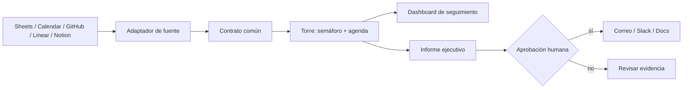

# Torre de Control Local — laboratorio n8n

Un ejercicio completo de automatización para clase: reúne proyectos, eventos y
calendario en un contrato común, calcula un semáforo, genera un informe
ejecutivo y conserva a una persona como responsable de las decisiones.

> No es una demo de “IA que hace todo”. Es una práctica de diseño: **fuentes →
> evidencia → reglas → informe → aprobación humana**.

## Qué entrega este repositorio

| Artefacto | Para qué sirve |
|---|---|
| `docker-compose.yml` | Arrancar n8n local y persistir sus datos. |
| `workflows/01-semilla-demostracion.json` | Práctica funcional sin cuentas ni API keys. |
| `workflows/02-torre-de-control.json` | Ingreso por contrato para conectar Calendar, Sheets, GitHub, Linear o Notion. |
| `workflows/03-informe-ejecutivo.json` | Informe en formato fijo, primero determinista y luego ampliable con IA. |
| `prompts/INFORME-EJECUTIVO.md` | Prompt y pruebas contra invenciones. |
| `samples/` | Datos de demostración y plantilla para dashboard. |
| `docs/` | Fundamentación, agenda docente, matriz de credenciales y arquitectura. |
| `GUIA-INTERACTIVA.html` | Laboratorio offline y autocontenido para que trabaje el estudiante. |

## El resultado que construyen



## Inicio rápido (docente)

### 1. Requisito local

Instale Docker Desktop. Esta máquina no tenía Docker ni n8n ejecutándose al
preparar el material; por eso el proyecto deja un arranque reproducible. La
guía oficial de n8n usa Docker, el puerto 5678 y un volumen persistente para la
instalación local. [Ver documentación oficial](https://docs.n8n.io/hosting/installation/docker/).

### 2. Arrancar n8n

```bash
cp .env.example .env
# Edite .env y reemplace N8N_ENCRYPTION_KEY por un secreto largo y aleatorio.
docker compose up -d
```

Abra [http://localhost:5678](http://localhost:5678), cree el usuario propietario
local y deje que cada estudiante cree sus propias credenciales dentro de n8n.

Para detenerlo sin borrar datos:

```bash
docker compose down
```

Los datos permanecen en el volumen `n8n_data`. Para una actualización
planificada, consulte las instrucciones de Docker Compose de n8n antes de
ejecutarla.

### 3. Importar y ejecutar la versión sin credenciales

1. En n8n seleccione **Import from File** e importe
   `workflows/01-semilla-demostracion.json`.
2. Ejecútelo manualmente.
3. Abra **Normalizar y priorizar**. El resultado contiene un snapshot de tres
   proyectos, próximos eventos y decisiones requeridas.
4. Cambie un valor de la semilla, por ejemplo `status` a `bloqueado`, y ejecute
   otra vez. Observe qué regla alteró el resultado.

Ese es el punto de partida seguro: el aprendizaje no depende de una cuenta
externa, de una API key ni de una conexión de aula.

## Conectar fuentes reales

Importe `workflows/02-torre-de-control.json`. Este workflow recibe un contrato
en `POST /webhook/control-tower`, normaliza cada registro y devuelve un
snapshot. En modo prueba, la URL es:

```text
http://localhost:5678/webhook-test/control-tower
```

Pruebe primero enviando el contenido de `samples/control-tower-demo.json` con
Postman, Bruno, curl o un nodo HTTP Request. Luego construya un flujo emisor por
fuente. El flujo emisor siempre termina en este mismo contrato:

```json
{
  "source": "nombre-de-la-fuente",
  "records": [{
    "id": "identificador-estable",
    "kind": "project|event|milestone",
    "title": "texto",
    "owner": "responsable",
    "status": "estado",
    "priority": "critica|alta|media|baja",
    "date": "ISO-8601",
    "blocker": "texto opcional"
  }]
}
```

No se conecta un proveedor directamente al informe. Se transforma su formato
original al contrato, se valida y recién entonces se consolida. La tabla de
conectores y el procedimiento están en
[MATRIZ-DE-CONEXIONES.md](docs/MATRIZ-DE-CONEXIONES.md).

### Secuencia recomendada de conectores

1. **Google Sheets**: usar `samples/dashboard-template.csv` como modelo de
   columnas. Leer filas de proyectos y mapear al contrato.
2. **Google Calendar**: usar la operación Event → Get Many para eventos de los
   próximos 7 días y mapearlos como `kind: event`. El nodo admite consultar
   eventos, además de crear, actualizar y borrar. [Documentación de n8n](https://docs.n8n.io/integrations/builtin/app-nodes/n8n-nodes-base.googlecalendar/)
3. **GitHub, Linear o Notion**: traer los ítems abiertos de un equipo o base,
   mapear prioridad/responsable/estado y enviar al mismo webhook.
4. **Salida**: sólo después de probar el snapshot, añadir Google Sheets,
   Gmail, Slack o Google Docs como salida aprobada.

## Informe con formato fijo

`03-informe-ejecutivo.json` produce un informe Markdown sin modelo: formato,
conteos, decisiones, semáforo y agenda se construyen desde datos trazables.
Esto permite que la clase pruebe el resultado antes de introducir IA.

Después, si la institución autoriza un modelo, conecte un nodo de OpenAI o Basic
LLM Chain y use [INFORME-EJECUTIVO.md](prompts/INFORME-EJECUTIVO.md). La IA puede
redactar y priorizar lenguaje; **no puede crear datos operativos ni enviar la
salida sin aprobación**.

### ChatGPT no es una API key

Tener una suscripción de ChatGPT no habilita automáticamente llamadas a la API:
son productos y sistemas de facturación separados. Para el nodo OpenAI se crea
una credencial de API en n8n y se controla su uso; si no hay presupuesto o
aprobación, el ejercicio funciona completo con el informe determinista o con
un proveedor autorizado por la institución. [Fuente oficial de OpenAI](https://help.openai.com/en/articles/8156019-is-api-usage-included-in-chatgpt-subscriptions-even-if-i-have-a-paid-chatgpt-account)

## Guion de clase

Abra `GUIA-INTERACTIVA.html` directamente desde el navegador: funciona offline,
guarda progreso en el equipo y permite exportar el plan de cada estudiante.
La fundamentación, resultados y rúbrica están en
[FUNDAMENTACION-DE-LA-CLASE.md](docs/FUNDAMENTACION-DE-LA-CLASE.md).

## Validación antes de la clase

```bash
node scripts/verify-artifacts.mjs
docker compose config
```

Al tener Docker instalado, haga además este ensayo con una carpeta de datos
limpia: arrancar n8n, importar los tres JSON y ejecutar `01` y `03`. Cree
credenciales de demostración por separado; los exports nunca incluyen secretos.

## Límites conscientes

- El dashboard de clase se muestra como snapshot JSON + plantilla CSV para que
  los estudiantes comprendan el dato antes de decorar gráficos.
- Para una producción real agregue deduplicación persistente, control de
  reintentos, manejo de errores, secretos administrados, auditoría y permisos
  mínimos.
- Un webhook expuesto al exterior requiere una URL pública segura; no publique
  la instancia local sólo para “hacer que funcione”. La documentación de n8n
  advierte que su túnel está pensado para desarrollo/pruebas, no para
  producción.

## Licencia propuesta

MIT para material educativo reutilizable. Revise las políticas de las fuentes
que conecte y nunca incluya en Git datos personales ni credenciales.
