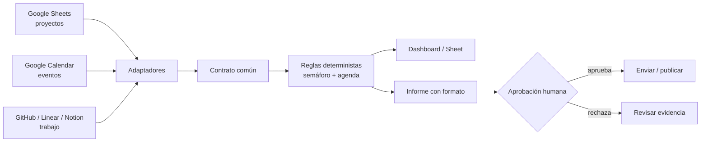

# Fundamentación — Automatización local con n8n: de fuentes dispersas a decisiones trazables

## Propuesta de valor

Esta clase no enseña a arrastrar nodos. Enseña a diseñar una **cadena de
decisión**: qué evidencia entra, cómo se normaliza, qué regla produce un
semáforo, qué puede redactar una IA y en qué punto una persona debe decidir.

El ejercicio supera una auditoría de repositorios porque cambia de un caso
lineal a una arquitectura reutilizable: proyectos, calendario y eventos
pueden venir de herramientas diferentes sin obligar al tablero a conocerlas
por separado. La pieza estable es el contrato de datos.

## Resultados de aprendizaje observables

Al terminar, cada estudiante podrá:

1. Ejecutar n8n en su equipo y distinguir configuración, volumen persistente y
   credenciales.
2. Explicar trigger, nodo, item, expresión, ejecución y credencial con un
   ejemplo funcional.
3. Definir un contrato común para al menos tres fuentes de verdad.
4. Conectar una fuente por OAuth/API, mapearla al contrato y verificar el
   resultado antes de continuar.
5. Separar reglas deterministas de redacción con IA.
6. Producir un informe ejecutivo con un formato verificable y una compuerta
   humana antes de una acción externa.

## Diseño de 3 horas

| Tiempo | Momento | Evidencia de aprendizaje |
|---:|---|---|
| 0–20 min | Mapa: “¿qué fuentes usan hoy para saber si un proyecto está en riesgo?” + demo del snapshot. | Cada persona identifica tres fuentes y un destinatario de la decisión. |
| 20–50 min | n8n local: iniciar Docker, abrir `localhost:5678`, importar y ejecutar `01`. | El estudiante muestra el JSON normalizado y explica cada nodo. |
| 50–85 min | Contrato común: modificar datos demo, insertar un bloqueo y revisar cómo cambia el semáforo. | Un registro con `source`, `kind`, `status`, `priority`, `date` y `owner`. |
| 85–105 min | Pausa + clínica de credenciales: OAuth, token personal, API key y secreto. | Matriz fuente–credencial–permiso mínimo. |
| 105–140 min | Conectar dos fuentes reales: Google Calendar + Sheets, GitHub, Linear o Notion. | Dos adaptadores que producen el mismo contrato. |
| 140–165 min | Informe: ejecutar `03`, auditar su formato; extender con IA solo para redacción. | Informe con decisiones, riesgos, agenda y evidencia. |
| 165–180 min | Actividad Reina y compromiso: diseñar la propia orquesta y exportar plan. | Un flujo, una compuerta humana y tres compromisos. |

## Principios que se enseñan explícitamente

### 1. El contrato reduce el acoplamiento

Un proyecto puede llegar desde Sheets y un evento desde Calendar. Sus campos
originales son distintos, pero el tablero sólo consume el contrato normalizado:
`source`, `externalId`, `kind`, `title`, `owner`, `status`, `priority`, `date`,
`blocker`, `url`, `capturedAt`. Cambiar Linear por Notion afecta un adaptador,
no el dashboard, las reglas ni el informe.

### 2. Primero determinismo, después IA

Contar bloqueos, ordenar fechas y decidir un semáforo deben venir de reglas
inspeccionables. La IA recibe el snapshot final para convertirlo en lenguaje
ejecutivo, no para inventar el estado operativo. Por eso el workflow 03 genera
primero un informe Markdown determinista y sólo después propone una extensión
con modelo.

### 3. Una credencial no es “conectar una cuenta”

Cada credencial se explica con cuatro preguntas: quién emite el permiso, qué
alcance pide, dónde vive el secreto y cómo se revoca. Las credenciales se crean
en n8n; no se exportan dentro de los workflows ni se guardan en Git.

### 4. Automatizar no equivale a delegar la decisión

El ejercicio ubica una compuerta humana antes de correo, Slack, documento o
cambio de estado. Es una responsabilidad de diseño: una alerta puede ser
automática; aprobar una prioridad crítica no.

## Fundamentación técnica verificada

- n8n documenta Docker como vía de instalación local; expone el servicio en el
  puerto 5678, usa `GENERIC_TIMEZONE` para nodos de calendario y persiste
  información en `/home/node/.n8n`. [Documentación oficial de Docker para n8n](https://docs.n8n.io/hosting/installation/docker/)
- El nodo de Google Calendar soporta crear, consultar, listar, actualizar y
  borrar eventos, por lo que es una fuente suficiente para el tramo de agenda
  del ejercicio. [Operaciones de Google Calendar en n8n](https://docs.n8n.io/integrations/builtin/app-nodes/n8n-nodes-base.googlecalendar/)
- Una suscripción de ChatGPT no incluye automáticamente uso de API: la
  facturación y la gestión de API son separadas. Esto se aborda como decisión
  de arquitectura, no como una sorpresa en medio de la clase. [Ayuda oficial de OpenAI](https://help.openai.com/en/articles/8156019-is-api-usage-included-in-chatgpt-subscriptions-even-if-i-have-a-paid-chatgpt-account)

## Evaluación auténtica (rúbrica breve)

| Criterio | Insuficiente | Logrado | Sobresaliente |
|---|---|---|---|
| Fuentes | Copia datos sin origen. | Dos fuentes trazables. | Tres fuentes, con adaptadores intercambiables. |
| Contrato | Campos ambiguos. | Usa el contrato mínimo. | Justifica campos, fecha y llave de deduplicación. |
| Reglas | El LLM “decide” riesgos. | Semáforo determinista. | Explica umbrales y prueba casos límite. |
| IA | Redacta sin control. | Prompt limita a evidencia. | Valida JSON, cita campos y rechaza alucinaciones. |
| Gobernanza | Sin responsable final. | Tiene una compuerta humana. | Define responsable, plazo y canal de escalamiento. |

## Preparación del docente

- Pruebe los tres workflows importándolos desde una carpeta limpia.
- Lleve `samples/control-tower-demo.json` como plan B para conectividad u OAuth.
- Prepare una hoja de cálculo con permisos de edición para el grupo o permita
  que cada estudiante use una copia.
- No proyecte ninguna API key. La clave se pega dentro de una credencial local.
- Mantenga el cierre en decisiones reales: “¿qué debe decidir alguien mañana?”
  es más valioso que “¿qué nodo usamos?”.
