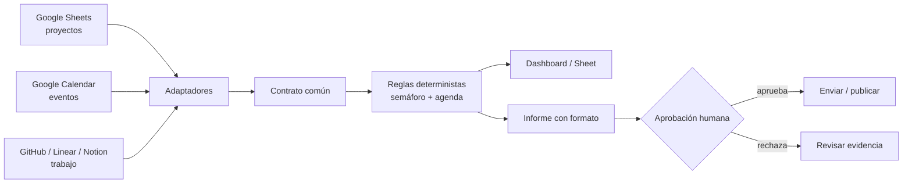

# Fundamentación — Automatización local con n8n: de fuentes dispersas a decisiones trazables

## Propuesta de valor

Esta clase no enseña a arrastrar nodos, y ya no enseña solo arquitectura de
datos: enseña a **dirigir a un agente de IA para que construya la
automatización, y a auditar lo que devuelve con evidencia real** — sobre una
arquitectura que el estudiante entiende lo suficiente para saber qué encargar
y qué no delegar nunca.

El vehículo sigue siendo el mismo caso: proyectos, calendario y eventos que
llegan de herramientas distintas, un contrato de datos que los normaliza, una
regla determinista que produce un semáforo, y una compuerta humana antes de
publicar. Eso no cambió. Lo que cambió es quién arma cada pieza: el estudiante
no la construye a mano, se la encarga a un agente y verifica el resultado —
exactamente como se construyó este mismo repositorio (ver
[CASO-DE-ESTUDIO.md](CASO-DE-ESTUDIO.md)).

> Esta arquitectura es lo que el estudiante necesita entender para
> **encargarla y auditar lo que reciba** — no necesariamente para construirla
> con sus propias manos. El documento que enseña ese encargo es
> [DIRIGIR-AL-AGENTE.md](DIRIGIR-AL-AGENTE.md).

## Resultados de aprendizaje observables

Al terminar, cada estudiante podrá:

1. **Encargarle a un agente de IA que construya una automatización, y auditar
   lo que devuelve con evidencia real** — no con su palabra. Es el resultado
   central de la clase: los siete siguientes son lo que necesita saber para
   poder encargar y auditar bien.
2. Ejecutar n8n en su equipo y distinguir configuración, volumen persistente y
   credenciales.
3. Explicar trigger, nodo, item, expresión, ejecución y credencial con un
   ejemplo funcional.
4. Definir un contrato común para al menos tres fuentes de verdad.
5. Conectar una fuente por OAuth/API, mapearla al contrato y verificar el
   resultado antes de continuar.
6. Separar reglas deterministas de redacción con IA.
7. Producir un informe ejecutivo con un formato verificable y una compuerta
   humana antes de una acción externa.
8. Usar un modelo de lenguaje como copiloto de su propio montaje: dar contexto,
   pegar el error literal, exigir que separe hecho de suposición, verificar con
   un comando propio y registrar la causa raíz — distinguiendo esa función de
   la de un agente que ejecuta por su cuenta y la de un modelo que corre dentro
   del flujo.

## Diseño de 3 horas

> **Apertura de la sesión (10–12 min, antes de la tabla).** La clase abre con una
> presentación corta sobre especificar antes de construir y definir el fallo
> antes de la solución. No se enseña como metodología de software, sino como dos
> hábitos de gestión que este público ya reconoce. El prompt para generarla está
> en [PROMPT-NOTEBOOKLM-APERTURA.md](PROMPT-NOTEBOOKLM-APERTURA.md).
>
> Esos minutos salen del primer bloque: el tramo "Mapa" se acorta y se apoya en
> la presentación, que ya deja planteada la pregunta por las fuentes de verdad.

| Tiempo | Momento | Módulo del lab | Evidencia de aprendizaje |
|---:|---|---|---|
| 0–15 min | Mapa: “¿qué fuentes usan hoy para saber si un proyecto está en riesgo?” + demo del snapshot. | 01 Inicio | Cada persona identifica tres fuentes y un destinatario de la decisión. |
| 15–30 min | **Dirigir, antes de tocar n8n**: las seis piezas de la arquitectura, los tres niveles de herramienta de IA (chat, app, agente con acceso al sistema) y la plantilla de un encargo. | 08 Dirigir | Cada estudiante nombra las seis piezas, sabe en qué nivel de herramienta está trabajando y trae escrito su primer encargo. |
| 30–50 min | El copiloto: las dos formas de usar un LLM, el protocolo de 4 pasos y la caza de alucinaciones. | 05 Copiloto | Cada estudiante tiene su herramienta abierta y sabe cuándo preguntarle a ella, cuándo a su máquina y cuándo a la persona docente. |
| 50–85 min | n8n local — **Encargo 1 y 2 de DIRIGIR-AL-AGENTE.md**: levantar el motor y entender el flujo `01` importado. **Aquí es donde aparecen los errores, y donde se audita de verdad.** | 06 Manos a la obra | El estudiante muestra el JSON normalizado, explica qué nodo lo produjo y qué decidió su agente sin que se lo pidiera. |
| 85–110 min | Contrato común: modificar datos demo, insertar un bloqueo y revisar cómo cambia el semáforo. | 02 Teoría | Un registro con `source`, `kind`, `status`, `priority`, `date` y `owner`. |
| 110–125 min | Pausa + clínica de credenciales: OAuth, token personal, API key y secreto. | 03 Brechas | Matriz fuente–credencial–permiso mínimo. |
| 125–140 min | Conectar una fuente real (Calendar o Sheets) con el **Encargo 3**. El resto de conectores queda para después con la matriz de conexiones. | 04 Laboratorios | Un adaptador real que produce el contrato, y la respuesta a "¿qué pasa el día que la desconectes?". |
| 140–162 min | Informe: ejecutar `03`, auditar su formato; **solo después** conectar un modelo para redacción (**Encargo 5**). | 04 Laboratorios | Informe con decisiones, riesgos, agenda y evidencia. |
| 162–180 min | Actividad Reina y compromiso: diseñar la propia orquesta y exportar plan. | 07 Compromisos | Un flujo, una compuerta humana y tres compromisos. |

> **El número del módulo no es el orden de dictado.** En el laboratorio HTML los
> módulos están numerados por tema (01 a 08), no por reloj. El módulo **08 ·
> Dirigir** es el segundo bloque que se dicta —antes de tocar n8n—, el **05 ·
> Copiloto** el tercero, y el **06 · Manos a la obra** el cuarto. La columna
> "Módulo del lab" de esta tabla es la referencia buena: los estudiantes
> navegan por pestañas, no en línea recta.

> **Por qué 08 · Dirigir va incluso antes que el copiloto:** sin las seis
> piezas y la plantilla de encargo, un estudiante no sabe qué pedirle a su
> herramienta en el primer error real del tramo 06. Enseñar la arquitectura
> después de que el grupo ya vivió mal el montaje sería explicar la teoría de
> un ejercicio que ya salió mal por falta de ella.

> **Por qué el copiloto va antes del montaje y no después:** si se enseña al final,
> queda como una curiosidad. Si se enseña antes, se convierte en la herramienta con
> la que el estudiante atraviesa la parte más frustrante de la clase — y ahí es
> donde el método se aprende de verdad, porque hay un error real en pantalla.

### Plan B de tiempos

Si el montaje se desborda (sigue siendo el tramo con más varianza), sacrifica
el bloque de 125–140 min: la conexión de fuentes reales se puede dejar como
trabajo posterior con la [matriz de conexiones](MATRIZ-DE-CONEXIONES.md). No
sacrifiques el bloque del informe ni el cierre: son los que cargan el mensaje
de la clase.

> **Con el módulo 08 agregado, este colchón bajó de 30 a 15 minutos.** Antes
> de esta versión, sacrificar por completo el bloque de fuentes reales
> liberaba media hora; ahora libera un cuarto. Si el montaje (tramo 06) se
> desborda más que eso, el siguiente bloque a recortar es **03 · Brechas**
> (110–125 min): reduce la clínica de credenciales a señalar la matriz ya
> resuelta en [MATRIZ-DE-CONEXIONES.md](MATRIZ-DE-CONEXIONES.md) en vez de
> completarla en vivo con el grupo.

## Principios que se enseñan explícitamente

### 1. El contrato reduce el acoplamiento

Un proyecto puede llegar desde Sheets y un evento desde Calendar. Sus campos
originales son distintos, pero el tablero sólo consume el contrato normalizado:
`source`, `externalId`, `kind`, `title`, `owner`, `status`, `priority`, `date`,
`blocker`, `url`, `capturedAt`. Cambiar Linear por Notion afecta un adaptador,
no el dashboard, las reglas ni el informe.

### 2. Primero determinismo, después IA

Contar bloqueos, ordenar fechas y decidir un semáforo deben venir de reglas
inspeccionables. La IA recibe el snapshot final para convertirlo en lenguaje
ejecutivo, no para inventar el estado operativo. Por eso el workflow 03 genera
primero un informe Markdown determinista y sólo después propone una extensión
con modelo.

### 3. Una credencial no es “conectar una cuenta”

Cada credencial se explica con cuatro preguntas: quién emite el permiso, qué
alcance pide, dónde vive el secreto y cómo se revoca. Las credenciales se crean
en n8n; no se exportan dentro de los workflows ni se guardan en Git.

### 4. Automatizar no equivale a delegar la decisión

El ejercicio ubica una compuerta humana antes de correo, Slack, documento o
cambio de estado. Es una responsabilidad de diseño: una alerta puede ser
automática; aprobar una prioridad crítica no.

## Fundamentación técnica verificada

> Verificado en julio de 2026 contra el registro de npm, el código fuente de
> `n8n-io/n8n` y la documentación oficial. Revisar la semana de la clase.

- Versión estable de n8n: **2.30.8**, con requisito de **Node.js >= 22.22**
  (verificado con `npm view n8n version` y `npm view n8n engines`, fuente
  primaria). Buena parte del contenido indexado en la web sigue citando el
  requisito de Node de la serie 1.x: **no sirve**.
- n8n documenta Docker como vía de instalación local; expone el servicio en el
  puerto 5678, usa `GENERIC_TIMEZONE` para nodos de calendario y persiste
  información en `/home/node/.n8n`. La instalación vía `npx n8n` sigue siendo
  oficialmente soportada. [Documentación oficial de Docker para n8n](https://docs.n8n.io/hosting/installation/docker/)
- `N8N_RUNNERS_ENABLED` está **deprecada desde n8n 2.0**: los task runners vienen
  activos por defecto y declararla solo ensucia los logs. Fue eliminada del
  `docker-compose.yml` de este repositorio por esa razón.
- La **Sustainable Use License** de n8n permite explícitamente el uso educativo.
  La restricción real es revender n8n como servicio competidor, que no aplica
  aquí. [Licencia oficial](https://docs.n8n.io/privacy-and-security/sustainable-use-license)
- El **AI Assistant** y el **AI Workflow Builder** integrados existen en
  self-hosted, pero requieren activación de licencia de instancia, endpoint
  configurado y API key propia. **No se demuestran en vivo en esta clase.**
- **La herramienta de IA que trae cada estudiante no es uniforme, y eso cambia
  la logística de los tramos 06 y 04.** Hay tres niveles reales: un chat en el
  navegador (ChatGPT, Claude, Gemini, DeepSeek), una aplicación de escritorio
  de las mismas, o un agente con acceso al sistema (Claude Code, Antigravity y
  similares). Con los dos primeros, cada paso lo teclea el estudiante y el
  tramo tiene más idas y vueltas; con el tercero, el agente ejecuta y verifica
  por su cuenta, y el tiempo se va en auditar, no en teclear. Los tres niveles
  están descritos en
  [DIRIGIR-AL-AGENTE.md](DIRIGIR-AL-AGENTE.md#antes-de-empezar-qué-puede-hacer-tu-herramienta).
  Conviene preguntar qué nivel trae cada quien antes de que empiece el tramo 06.
- Un modelo dentro del flujo tiene cuatro caminos gratuitos con nodo propio o
  compatible: Ollama, Google Gemini, Groq y Cerebras. Detalle, límites reales y
  el gotcha de red entre Docker y Ollama en [PROVEEDORES-LLM.md](PROVEEDORES-LLM.md).
- El nodo de Google Calendar soporta crear, consultar, listar, actualizar y
  borrar eventos, por lo que es una fuente suficiente para el tramo de agenda
  del ejercicio. [Operaciones de Google Calendar en n8n](https://docs.n8n.io/integrations/builtin/app-nodes/n8n-nodes-base.googlecalendar/)
- Una suscripción de ChatGPT no incluye automáticamente uso de API: la
  facturación y la gestión de API son separadas. Esto se aborda como decisión
  de arquitectura, no como una sorpresa en medio de la clase. [Ayuda oficial de OpenAI](https://help.openai.com/en/articles/8156019-is-api-usage-included-in-chatgpt-subscriptions-even-if-i-have-a-paid-chatgpt-account)

## Evaluación auténtica (rúbrica breve)

| Criterio | Insuficiente | Logrado | Sobresaliente |
|---|---|---|---|
| Fuentes | Copia datos sin origen. | Dos fuentes trazables. | Tres fuentes, con adaptadores intercambiables. |
| Contrato | Campos ambiguos. | Usa el contrato mínimo. | Justifica campos, fecha y llave de deduplicación. |
| Reglas | El LLM “decide” riesgos. | Semáforo determinista. | Explica umbrales y prueba casos límite. |
| IA | Redacta sin control. | Prompt limita a evidencia. | Valida JSON, cita campos y rechaza alucinaciones. |
| Gobernanza | Sin responsable final. | Tiene una compuerta humana. | Define responsable, plazo y canal de escalamiento. |
| Copiloto | Copia y pega lo que el modelo diga, sin entenderlo. | Da contexto, pega el error literal y verifica antes de ejecutar. | Detecta una respuesta inventada y explica la causa raíz con sus palabras. |

## Preparación del docente

- Pruebe los tres workflows importándolos desde una carpeta limpia.
- Lleve `samples/control-tower-demo.json` como plan B para conectividad u OAuth.
- Prepare una hoja de cálculo con permisos de edición para el grupo o permita
  que cada estudiante use una copia.
- No proyecte ninguna API key. La clave se pega dentro de una credencial local.
- Mantenga el cierre en decisiones reales: “¿qué debe decidir alguien mañana?”
  es más valioso que “¿qué nodo usamos?”.
